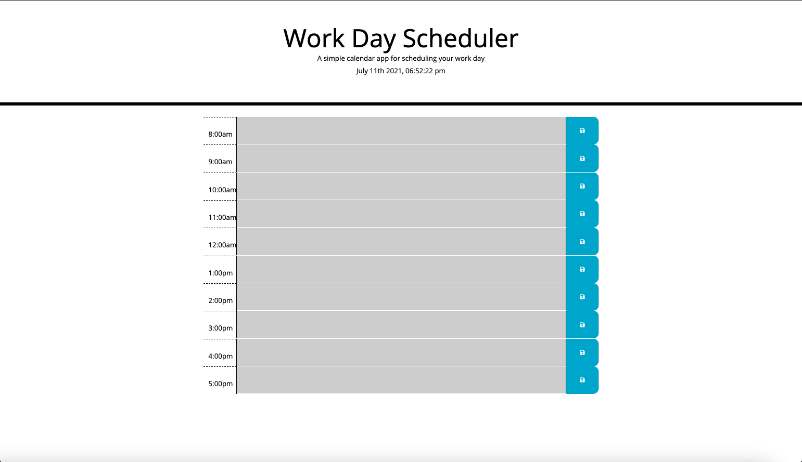

# Daily-Planner

# Description of Project

    * This is a working Daily Planner that can be used by employee's that have very busy schedules, to keep track of their day.
    * Using updated HTML, CSS, and JavaScript

# Describing Code

    * Using bootstrap was able to create different time-blocks for each working hour in the day.
    * Added local storage so when an employee saves their event it will stay in that time-block until deleted.
    * When the time is in the present the time-block for that certain time will be red, future times is green, and the past times will display red. 

# Screenshot of Website

